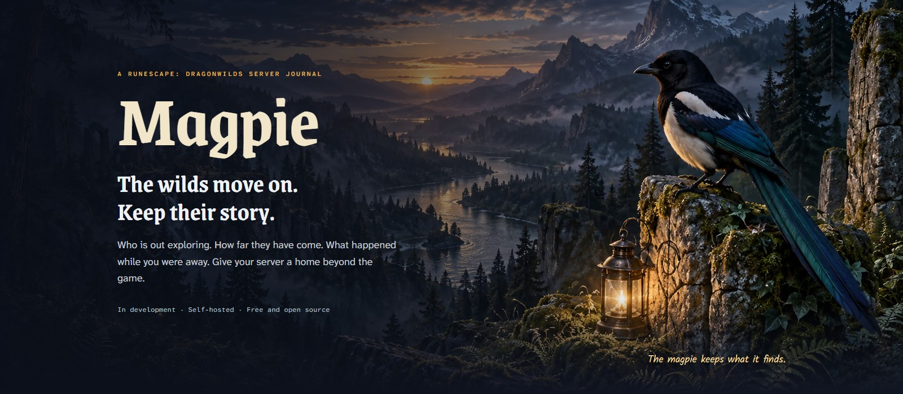
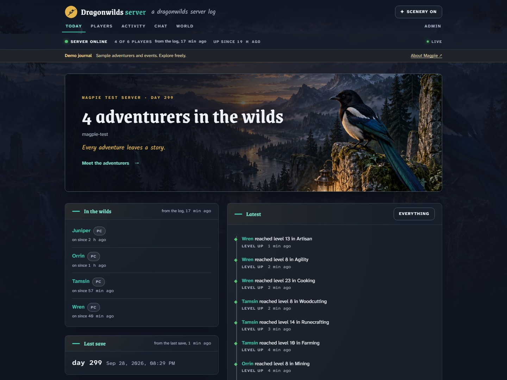
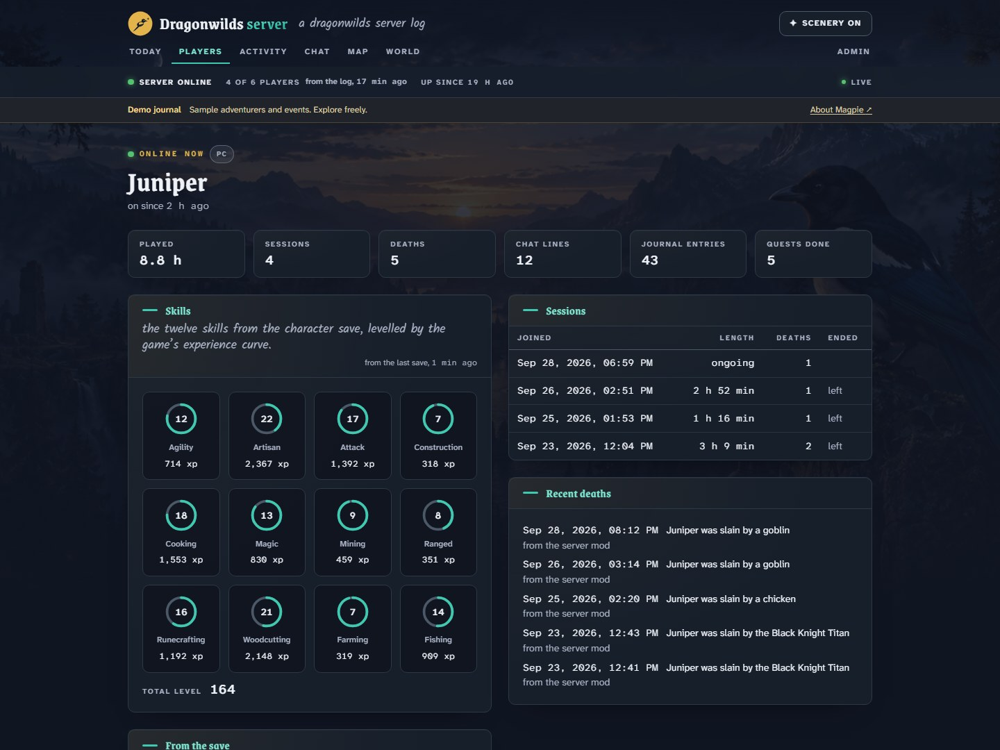
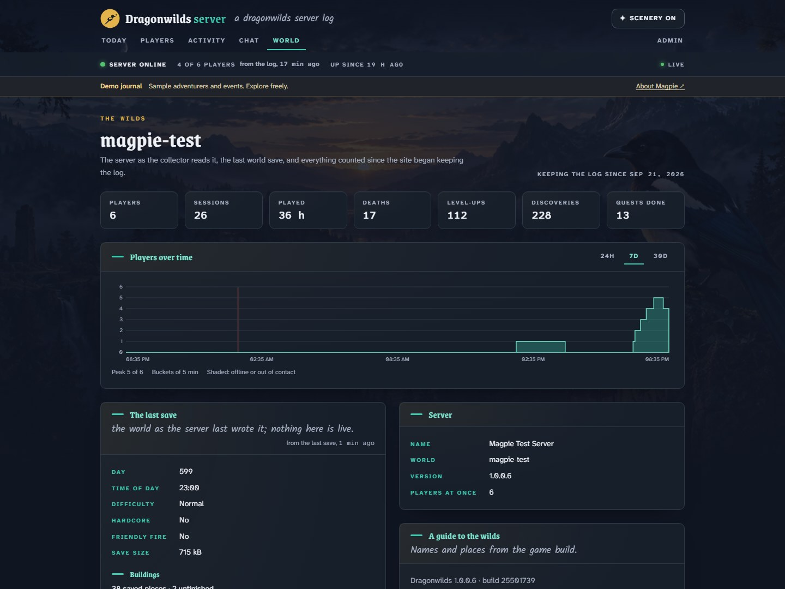

<p align="center">
  <a href="https://oddessentials.github.io/magpie/"></a>
</p>

<p align="center">
  <a href="https://oddessentials.github.io/magpie/"><b>Website</b></a> &nbsp;·&nbsp;
  <a href="https://oddessentials.github.io/magpie/demo.html"><b>Demo tour</b></a> &nbsp;·&nbsp;
  <a href="#install"><b>Install</b></a> &nbsp;·&nbsp;
  <a href="#collector-reference"><b>Collector</b></a> &nbsp;·&nbsp;
  <a href="mod/README.md"><b>Server mod</b></a> &nbsp;·&nbsp;
  <a href="web/openapi.yaml"><b>API</b></a> &nbsp;·&nbsp;
  <a href="LICENSE"><b>MIT licence</b></a>
</p>

Magpie gives a RuneScape: Dragonwilds dedicated server its own website: who is online, how far each adventurer has come, what the wilds did today, and the history of all of it. A collector runs beside the server and reports to the site; players install nothing.

**In development.** The journal works today; the project is still being built. The screenshots below use sample data. [Explore the demo tour](https://oddessentials.github.io/magpie/demo.html), or run `npm run dev:mock` after the development setup to browse the working app without a game server or running database. The admin area has no server actions in this version.

## A look inside the journal



**The day at a glance.** Who is exploring, what just happened, and when the server last saved. Live observations and saved progress carry their source and freshness. Original woodland artwork sets the scene; the Scenery button switches it off and remembers your preference.



**Every adventurer's progress.** Twelve skills, sessions, quests and journal discoveries, drawn from the server's own records. The skill rings show progress toward the next level.



**The world beyond your last visit.** See regional weather, world events and the day from the last save, alongside server history and the sources the collector can read.

## What the site shows

- **Today.** The server's state, who is in the wilds and since when, the last save, the latest events, and the last day as a chart of players over time. Every live figure says where it came from and how old it is.
- **Players.** Everyone who has joined since the site began keeping the log, with playtime, sessions and deaths. A player's page carries the twelve skills from the character save, levelled by the game's own experience curve, with total level, sessions, deaths, quests, journal entries and what the log has counted.
- **Activity.** Deaths, discoveries, level-ups, quests, crafts, builds, boss summons, base raids and dragon events, filtered by kind.
- **Chat.** The server's chat, when the admin turns it on and the server mod is installed. Off by default.
- **World.** The world as the server last saved it: day, difficulty, hardcore and friendly fire, regional weather, world events, building counts, triggered world hooks and defeated bosses. A separate guide lists build-stamped region, lodestone and boss names. Time of day stays unknown until the save's StoredTime units are verified; the demo's clock is illustrative.
- **Admin.** Settings, the collector's secret and health, the raw event stream, backups, jobs. No server actions in this version.

Facts come from three places, and the site keeps them apart: the server's log (joins and leaves to the second, deaths, discoveries), the world save (skills, quests, journal, weather and the day, never live, always marked with the time of the save), and the optional [server mod](mod/README.md) (chat, level-ups, quests, crafting, building, the world's events, and a stop that saves the world first). Names of skills, quests, journal entries and items come from the game's own files, read from the dedicated server build and stamped with the Steam build they were read from.

## Install

1. Run the site with Docker Compose on a machine the collector can reach:

   ```sh
   git clone https://github.com/oddessentials/magpie.git && cd magpie
   cp .env.example .env
   docker compose --profile site up -d --build
   ```

2. Open `/admin` on the site (port 3000 with Docker Compose), set the password, and copy the collector secret from the Collector page.
3. Download the collector for your platform from a [release](https://github.com/oddessentials/magpie/releases) or pull `ghcr.io/oddessentials/magpie-collector`, or build it with `npm run collector:build` (Go 1.27). Put `magpie-savereader` beside it, write `magpie-collector.toml`, and run it beside the dedicated server:

   ```toml
   [site]
   url = "https://magpie.example.com"
   secret = "the collector secret from the site"

   [dragonwilds]
   server_dir = "C:/dragonwilds-server"
   ```

   With `server_dir` alone the collector follows the server's log and world save. To let it start and stop the server as well, add `[launch]` with the server's command; to read chat and everything else the log never reports, install the [server mod](mod/README.md).

**Rented servers.** The collector needs the server's log and save files where it runs, so it has to run on the same machine or share its files. A rented server without a shell or a shared folder cannot run it in this version.

<details>
<summary><b>Site settings</b></summary>

The site is a SvelteKit app on Node 24 with PostgreSQL 18. It migrates the database when it starts.

| Variable                       | Default              | Meaning                                                                                                                     |
| ------------------------------ | -------------------- | --------------------------------------------------------------------------------------------------------------------------- |
| `DATABASE_URL`                 |                      | PostgreSQL connection string.                                                                                               |
| `COLLECTOR_SECRET`             | generated            | The secret the collector signs its batches with. When unset the site generates one and shows it on the admin Collector page. |
| `ADMIN_PASSWORD`               |                      | The admin password. When unset the first visitor to `/admin` sets it.                                                       |
| `ADMIN_SESSION_SECRET`         | generated            | Signs admin sessions.                                                                                                       |
| `PUBLIC_SITE_NAME`             | `Dragonwilds server` | The site name; also settable on the admin Settings page.                                                                    |
| `ORIGIN`                       |                      | The address people use, for example `https://magpie.example.com`. Admin changes must come from it.                          |
| `BACKUP_DIR`, `BACKUPS_KEPT`   | `/backups`, `14`     | Nightly `pg_dump` backups.                                                                                                  |
| `API_MOCK`                     | `0`                  | `1` serves the recorded fixtures instead of a database, for trying the pages.                                               |

The API is described in `web/openapi.yaml` and served at `/api/v1/openapi.json`. `/api/v1/stream` sends live updates as server-sent events.

</details>

<details id="collector-reference">
<summary><b>Collector reference</b></summary>

The collector is one binary for Windows x64, Linux x64 and Linux arm64. It reads the server's log, the world save through `magpie-savereader`, and the server mod's events file, turns what it sees into events, and posts them in signed batches to your site. Queued events wait in a journal on disk until the site confirms them and are replayed after a restart or site outage.

| `logs.source` | How the collector reads the server's log                                                                                                                                                                                                       |
| ------------- | ---------------------------------------------------------------------------------------------------------------------------------------------------------------------------------------------------------------------------------------------- |
| `launch`      | Starts the server itself as an ordinary child process. Ctrl+C, a service stop or `magpie-collector stop` writes the mod's stop file so the server saves the world and quits; after `launch.stop_wait` without an exit the server is terminated. |
| `file`        | Follows `RSDragonwilds/Saved/Logs/RSDragonwilds.log` in `dragonwilds.server_dir`, or `file.path`, through the rename the engine does at every start. The default when `server_dir` is set.                                                     |
| `docker`      | Follows a container's log through the Docker Engine API (`/var/run/docker.sock`, the Windows named pipe or `docker.host`).                                                                                                                     |
| `stdin`       | Reads the server's output from a pipe. The collector stops when the server does.                                                                                                                                                               |
| `none`        | Saves and mod events only.                                                                                                                                                                                                                     |
| `remote` | Polls one remote log file over FTP, explicit FTPS or SFTP, retaining a cursor across reconnects and collector restarts. |

On Windows the collector can run as a service: from a terminal opened with Run as administrator, `magpie-collector service install --config C:\magpie\magpie-collector.toml` registers a service that starts with Windows and restarts after a failure; `service start`, `service stop` and `service remove` manage it.

The collector reads `magpie-collector.toml` beside the binary, or the file given with `--config`. Every key can also be set with an environment variable named `MAGPIE_` plus the section and key in capitals, such as `MAGPIE_SITE_SECRET`.

| Key                                                       | Default                                               | Meaning                                                                                                                    |
| --------------------------------------------------------- | ----------------------------------------------------- | -------------------------------------------------------------------------------------------------------------------------- |
| `site.url`, `site.secret`                                 |                                                       | The Magpie site and its collector secret. Batches go to `/api/ingest`.                                                     |
| `dragonwilds.server_dir`                                  |                                                       | The server's install folder. The collector reads `ServerName` and `DefaultWorldName` from its `DedicatedServer.ini`, nothing else. |
| `logs.source`                                             | `launch`, `docker` or `file` from the keys below      | See above.                                                                                                                 |
| `launch.command`, `launch.args`, `launch.work_dir`        |                                                       | The server to start.                                                                                                       |
| `launch.stop_wait`                                        | `90s`                                                 | How long a stop waits for the save and the exit before terminating the server.                                             |
| `docker.container`, `docker.host`                         |                                                       | The container to follow and the Docker endpoint.                                                                           |
| `file.path`                                               |                                                       | The log file to follow.                                                                                                    |
| `saves.reader`                                            | `magpie-savereader` beside the collector              | The save reader. Without one the world save is not read.                                                                   |
| `saves.path`                                              | `RSDragonwilds/Saved/SaveGames` in `server_dir`       | Where the world save is.                                                                                                   |
| `saves.interval`                                          | `30s`                                                 | How often the collector looks for a newer save.                                                                            |
| `mod.events`, `mod.stop`                                  |                                                       | The [server mod](mod/README.md)'s events file and stop file. In launch mode the collector hands both paths to the server's environment; otherwise set the paths the server's environment gives the mod. |
| `intervals.metrics`, `heartbeat`, `flush`, `actions`      | `30s`, `60s`, `2s`, `5s`                              | Reporting and sending periods.                                                                                             |
| `journal_dir`                                             | `magpie-journal` beside the config file               | Where events wait until the site confirms them.                                                                            |

`magpie-collector check` reports what the configuration resolves to and what it can reach, and `--dry-run` prints the batches instead of sending them.

For a rented server, set `logs.remote` to the full URL of its log and `saves.remote` to the full URL of its world `.sav`. FTP and FTPS URL paths are relative to the login directory; use an encoded leading slash for an absolute path. SFTP paths are absolute, or use `/~/` for the login directory. There are no separate player saves to download and no REST or RCON fallback.

```toml
[logs]
source = "remote"
remote = "sftp://user@example.invalid/~/RSDragonwilds/Saved/Logs/RSDragonwilds.log"
host_key = "SHA256:replace-with-provider-verified-fingerprint"
interval = "5s"
timeout = "30s"

[saves]
remote = "sftp://user@example.invalid/~/RSDragonwilds/Saved/SaveGames/world.sav"
host_key = "SHA256:replace-with-provider-verified-fingerprint"
interval = "30s"
timeout = "30s"
```

Supply `MAGPIE_LOGS_PASSWORD` and `MAGPIE_SAVES_PASSWORD`, or the `logs.key` and `saves.key` private-key paths. Each SFTP endpoint requires its own explicit `host_key` pin, obtained through the provider; a changed key is refused. FTPS verifies the server certificate and protects both connections with TLS. Plain FTP is also supported. Use `saves.path` for a local save or `saves.remote` for a remote one.

Remote logs read incremental ranges and check the preceding bytes for rotation or truncation. Complete lines advance the persisted cursor; partial lines wait for the next poll. Identical replacements without a changed length or preceding bytes cannot be distinguished on these protocols. The first connection reads the available log from its beginning. `logs.interval` defaults to 5 seconds (1–60 seconds allowed); `saves.interval` defaults to 30 seconds (at least 10 seconds). Timeouts apply to each listing or transfer, and an unavailable endpoint is retried on the next poll.

Remote saves are limited to 512 MiB. A download must match the remote size and modification time before and after copying, pass the SPUD completeness check, and decode successfully before replacing the local copy. Unchanged size/time pairs skip a repeated decode. The mirror keeps the remote timestamp; a provider that supplies no save modification time is refused. The site labels these observations **Polled**, shows cadence and successful-check times on the world page, and keeps save freshness separate from download time.

Before anything leaves the machine the collector removes the world password from the log's login lines, the password lines the server prints, join codes, addresses, platform ids and every other id, keeping a player's name and platform family. Your site never shows any of them.

</details>

<details>
<summary><b>Development</b></summary>

```sh
npm install
docker compose up -d db
npm run db:migrate
npm run dev
```

`npm run dev:mock` runs the pages on recorded fixtures without a server. `npm run verify` runs what CI runs: formatting, the no-comments rule, the mod check, the contract lint and types, the fixtures, the site's tests and build, and the Go tests and builds for the collector and the save reader.

Facts about the game come from the free dedicated server's own files: `tools/gamefacts` reads the cooked packages with the mappings file in `tools/rig/mappings` and writes `web/src/lib/world`, each file stamped with the Steam build and game version it was read from; a daily workflow opens an issue when the public build changes. `tools/rig` holds the scripts that run a bounded, recorded server session (`run_server.py`, with the UE4SS probe mods that dump the mappings file and every function name) and decode saves and containers by hand.

The artwork is original to Magpie. The woodland master is in `art/source/wilds.png`, with its image-generation prompt and provenance in `art/source/wilds.json`; the bird mark and icon sources remain vectors in `art/`. No game artwork or textures are used. `npm run art:export` rebuilds the raster variants, synchronizes the AVIF/WebP scenery used by the app and landing page, and exports responsive AVIF/WebP landing-page previews from the captured JPEGs. PNG masters stay in `art/`. Use `npm run art:export -- previews` to regenerate only those previews; `npm run art:capture` also stages and validates them with the screenshots.

`npm run art:capture` starts temporary local servers, captures desktop and phone views with sample data, and rebuilds the README banner and social cards using headless Chromium (install it once with `npx playwright install chromium`). Captures use the status fixture's timestamp, UTC and a fixed locale, and ignore external API overrides. Images are staged and validated before the existing set is replaced. `npm run art:capture -- --check` compares a fresh capture with the committed images without changing them; use the same browser version and platform for byte-for-byte comparisons. `npm run site:preview` serves the landing page and screenshot tour at `http://127.0.0.1:5180`. The tour selects phone screenshots on small screens and also works without JavaScript; `npm run dev:mock` runs the interactive app.

`node scripts/measure-presentation.mjs after` measures the landing page and demo tour on a local static server in three fresh Chromium contexts each: 390 × 844 CSS pixels, DPR 3, 1.6 Mbps download, 750 Kbps upload, 150 ms latency, 4× CPU slowdown and disabled cache. It records LCP elements, resource timings, image selection, fonts, layout shifts, browser version and screenshots under ignored `local/`, checks attribution and horizontal overflow, and fails if any LCP reaches 2.5 seconds. Compare runs on the same machine and browser with other builds stopped. These are local lab measurements, not field p75 Core Web Vitals.

Pushing a tag `v<version>` that matches the `package.json` version publishes `ghcr.io/oddessentials/magpie` and `ghcr.io/oddessentials/magpie-collector` for amd64 and arm64, and a GitHub release with the collector and save reader binaries, the mod as a zip, and their checksums.

</details>

Magpie observes an official dedicated server; it is not a client or a server, and nothing in it changes gameplay. The server mod is a modification of the server in the sense of Jagex's community modding guidelines and is optional. Created using intellectual property belonging to Jagex Limited under the terms of Jagex's Fan Content Policy. This content is not endorsed by or affiliated with Jagex.
